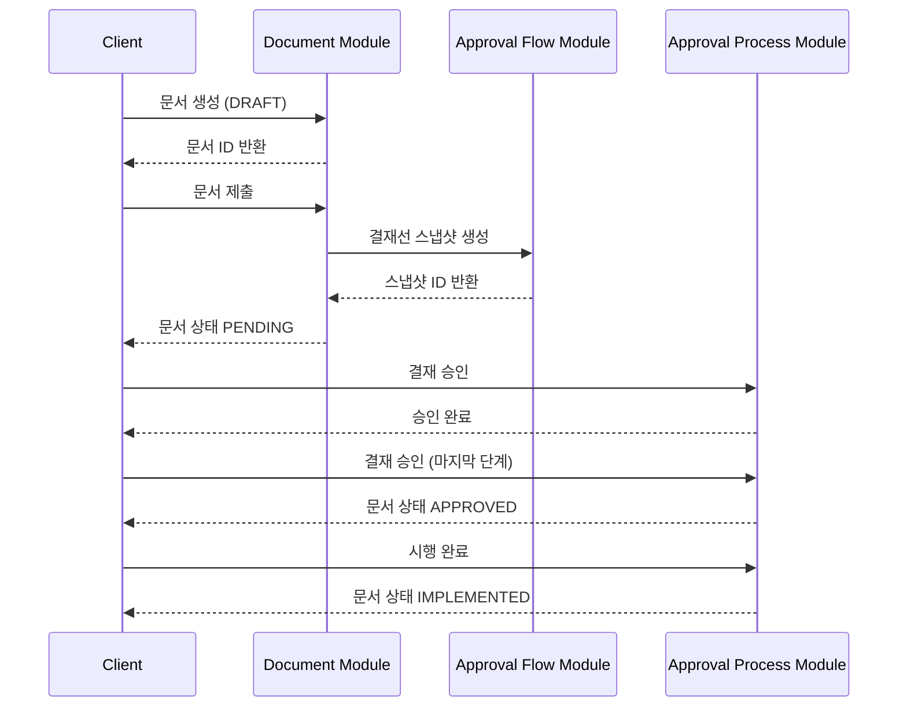

# Business Layer (v2)

LIAS 결재 시스템 v2의 비즈니스 레이어입니다.

## 📌 개요

Business Layer는 HTTP 요청을 받아 비즈니스 로직을 실행하고, Context Layer를 통해 도메인 엔티티를 조작하는 역할을 담당합니다.

## 🏗️ 레이어 구조

```
┌─────────────────────────────────────────┐
│         HTTP Client (Frontend)          │
└─────────────────────────────────────────┘
                    ↓
┌─────────────────────────────────────────┐
│    Business Layer (Controllers)         │ ← 현재 레이어
│  - API 엔드포인트                         │
│  - Request/Response DTO                 │
│  - Swagger 문서화                        │
└─────────────────────────────────────────┘
                    ↓
┌─────────────────────────────────────────┐
│    Business Layer (Usecases)            │ ← 현재 레이어
│  - 비즈니스 로직 실행                     │
│  - 권한 검증                             │
│  - 데이터 검증                           │
└─────────────────────────────────────────┘
                    ↓
┌─────────────────────────────────────────┐
│       Context Layer                     │
│  - 트랜잭션 관리                         │
│  - 복잡한 도메인 로직 조합                │
└─────────────────────────────────────────┘
                    ↓
┌─────────────────────────────────────────┐
│       Domain Layer                      │
│  - 엔티티 CRUD                          │
│  - 단순 비즈니스 규칙                    │
└─────────────────────────────────────────┘
```

## 📂 모듈 구조

```
business/
├── approval-flow/          # 결재 흐름 설정
│   ├── controllers/
│   ├── usecases/
│   ├── dtos/
│   └── README.md
├── document/               # 문서 관리
│   ├── controllers/
│   ├── usecases/
│   ├── dtos/
│   └── README.md
├── approval-process/       # 결재 프로세스 실행
│   ├── controllers/
│   ├── usecases/
│   ├── dtos/
│   └── README.md
└── index.ts
```

## 🎯 모듈별 책임

### 1. Approval Flow Module

**책임:** 결재 흐름 설정 및 관리

**주요 기능:**

- 문서양식 생성 및 결재선 연결
- 문서양식 수정 (버전 관리)
- 결재선 템플릿 복제 및 버전 관리
- 결재 스냅샷 생성 (기안 시)

**API Base Path:** `/api/v2/approval-flow`

📚 [상세 문서](./approval-flow/README.md)

---

### 2. Document Module

**책임:** 문서 생명주기 관리

**주요 기능:**

- 문서 생성 (임시저장)
- 문서 수정
- 문서 제출 (결재선 스냅샷 생성 포함)
- 문서 삭제
- 문서 조회 (ID, 기안자별, 상태별)

**API Base Path:** `/api/v2/document`

📚 [상세 문서](./document/README.md)

---

### 3. Approval Process Module

**책임:** 결재 프로세스 실행

**주요 기능:**

- 결재 승인
- 결재 반려
- 협의 완료
- 시행 완료
- 결재 취소
- 결재 상태 조회

**API Base Path:** `/api/v2/approval-process`

📚 [상세 문서](./approval-process/README.md)

---

## 🔄 모듈 간 상호작용

### 문서 생성 ~ 결재 완료 플로우



### 주요 인터랙션 포인트

1. **Document → Approval Flow**

    - 문서 제출 시 결재선 스냅샷 생성 요청
    - `SubmitDocumentUsecase` → `ApprovalFlowContext.createApprovalSnapshot()`

2. **Approval Process → Document**

    - 결재 상태 변경 시 문서 상태 업데이트
    - `ApproveStepUsecase` → `ApprovalProcessContext.approveStep()` → 문서 상태 변경

3. **Approval Flow → Document**
    - 문서양식 생성 시 초기 설정
    - `CreateFormWithApprovalLineUsecase` → `ApprovalFlowContext.createFormWithApprovalLine()`

## 📊 데이터 흐름

### 일반적인 요청 흐름

```
HTTP Request
  ↓
Controller (라우팅, 파라미터 검증)
  ↓
Usecase (비즈니스 로직 실행)
  ↓
Context (트랜잭션 관리, 복잡한 도메인 로직 조합)
  ↓
Domain Service (엔티티 CRUD)
  ↓
Repository (데이터베이스 접근)
  ↓
Database
```

### 트랜잭션 범위

```
┌─────────────────────────────────────────┐
│ Usecase                                 │
│  ┌───────────────────────────────────┐  │
│  │ Context (Transaction Boundary)    │  │
│  │  ┌─────────────────────────────┐  │  │
│  │  │ Domain Service 1            │  │  │
│  │  └─────────────────────────────┘  │  │
│  │  ┌─────────────────────────────┐  │  │
│  │  │ Domain Service 2            │  │  │
│  │  └─────────────────────────────┘  │  │
│  │  [Commit or Rollback]            │  │
│  └───────────────────────────────────┘  │
└─────────────────────────────────────────┘
```

## 🔐 권한 관리

### 현재 구현 상태

현재는 DTO에 전달된 사용자 ID를 신뢰하는 구조입니다.

### 프로덕션 환경 필수 구현

```typescript
// 1. JWT Guard 적용
@UseGuards(JwtAuthGuard)
@Controller('document')
export class DocumentController {

  // 2. 요청자 정보 추출
  @Post()
  async createDocument(
    @CurrentUser() user: User,  // JWT에서 추출
    @Body() dto: CreateDocumentRequestDto
  ) {
    // dto.drafterId 대신 user.id 사용
    return this.usecase.execute({ ...dto, drafterId: user.id });
  }
}

// 3. 권한 검증
@UseGuards(JwtAuthGuard, RoleGuard)
@Roles('APPROVER')
@Post('approve')
async approveStep(...) {
  // 결재자만 승인 가능
}
```

## ✅ 공통 검증 규칙

### Request DTO 검증

- `class-validator` 사용
- 모든 필수 필드는 `@IsNotEmpty()` 데코레이터 적용
- UUID 필드는 `@IsUUID()` 데코레이터 적용
- Enum 필드는 `@IsEnum()` 데코레이터 적용

### 비즈니스 로직 검증

- 엔티티 존재 여부 확인 (`NotFoundException`)
- 상태 전환 가능 여부 확인 (`BadRequestException`)
- 권한 여부 확인 (`ForbiddenException`)

## 🧪 테스트

### E2E 테스트 위치

```
test/
├── approval-flow.e2e-spec.ts       # Approval Flow 테스트
├── document.e2e-spec.ts            # Document 테스트
└── approval-process.e2e-spec.ts    # Approval Process 테스트
```

### 테스트 실행

```bash
# 전체 E2E 테스트
npm run test:e2e

# 특정 모듈 테스트
npm run test:e2e approval-flow.e2e-spec
npm run test:e2e document.e2e-spec
npm run test:e2e approval-process.e2e-spec

# 커버리지 포함
npm run test:e2e -- --coverage
```

### 테스트 전략

1. **단위 테스트**: Usecase 레벨
2. **통합 테스트**: Context 레벨
3. **E2E 테스트**: Controller 레벨 (실제 데이터베이스 사용)

## 📝 코딩 규칙

### Controller 작성 규칙

```typescript
@ApiTags('모듈명')
@Controller()
export class XxxController {
    constructor(
        private readonly usecase1: Usecase1,
        private readonly usecase2: Usecase2,
    ) {}

    @Post()
    @HttpCode(HttpStatus.CREATED) // 상태 코드 명시
    @ApiOperation({ summary: '요약', description: '상세 설명' })
    @ApiResponse({ status: 201, description: '성공', type: ResponseDto })
    @ApiResponse({ status: 400, description: '실패 사유' })
    async create(@Body() dto: RequestDto): Promise<ResponseDto> {
        return this.usecase1.execute(dto);
    }
}
```

### Usecase 작성 규칙

```typescript
@Injectable()
export class XxxUsecase {
    private readonly logger = new Logger(XxxUsecase.name);

    constructor(private readonly context: XxxContext) {}

    async execute(dto: RequestDto): Promise<ResponseDto> {
        this.logger.log(`작업 시작: ${dto.id}`);

        // 비즈니스 로직 실행
        const result = await this.context.someMethod(dto);

        this.logger.log(`작업 완료: ${result.id}`);
        return result;
    }
}
```

### DTO 작성 규칙

```typescript
// Request DTO
export class XxxRequestDto {
    @ApiProperty({ description: '설명', example: '예시' })
    @IsNotEmpty()
    @IsString()
    field1: string;

    @ApiProperty({ description: '설명', required: false })
    @IsOptional()
    @IsNumber()
    field2?: number;
}

// Response DTO
export class XxxResponseDto {
    @ApiProperty({ description: '설명' })
    id: string;

    @ApiProperty({ description: '설명' })
    field1: string;
}
```

## 🚀 성능 최적화

### 캐싱 전략

- Redis를 활용한 자주 조회되는 데이터 캐싱
- 결재 대기 개수, 양식 템플릿 등

### 데이터베이스 최적화

- 인덱싱: 자주 조회되는 필드
- 페이지네이션: 목록 조회 API
- N+1 문제 해결: `relations` 옵션 활용

### 비동기 처리

- 알림 발송: 메시지 큐 활용 (RabbitMQ, Kafka)
- 무거운 작업: 백그라운드 작업으로 처리

## 📚 관련 문서

- [전체 API 문서](../../../docs/API-DOCUMENTATION.md)
- [트랜잭션 사용 가이드](../../../docs/transaction-usage.md)
- [결재 시스템 설계 규칙](./approval-flow/NOTE.md)

## 🔮 향후 계획

### 기능 확장

- [ ] 파일 첨부 기능
- [ ] 댓글/의견 시스템
- [ ] 결재 알림 시스템 (Slack, Email, Push)
- [ ] 결재 통계 및 대시보드
- [ ] 모바일 앱 지원

### 아키텍처 개선

- [ ] CQRS 패턴 적용 (읽기/쓰기 분리)
- [ ] 이벤트 소싱 패턴 적용
- [ ] GraphQL API 지원
- [ ] 마이크로서비스 분리 검토

---

**문서 버전:** 1.0.0  
**최종 업데이트:** 2025-10-21  
**작성자:** LIAS Development Team
